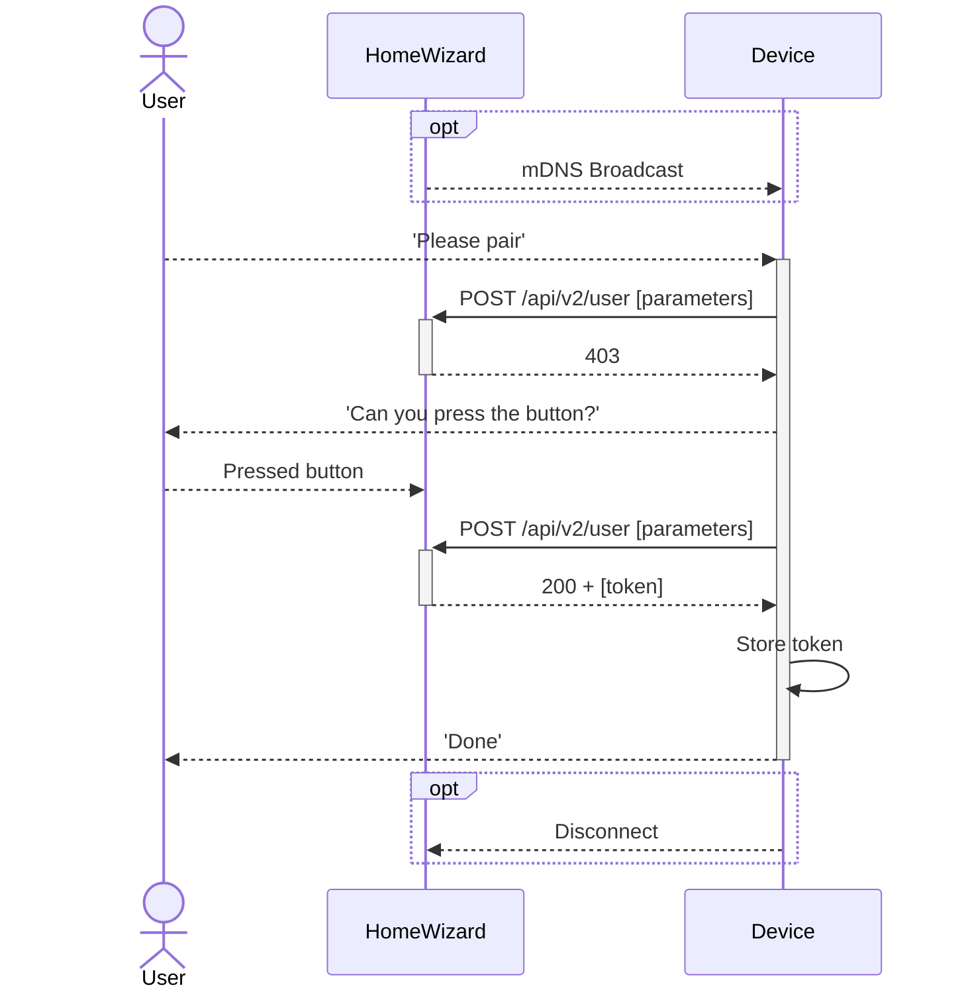

import PreliminaryWarning from '@site/src/components/PreliminaryWarning.js'

# Authorization `/api/v2/user`

:::danger[TODO]

-   Add information about the token, like how long it is valid, how to revoke it, etc.
-   Add user parameter requirements
-   Add details about how long a initial request is valid, how long time until uses must press button
-   Tell users cloud can also generate tokens for battery pairing
-   Add GET and DELETE method description
    :::

<PreliminaryWarning />

The HomeWizard Energy API uses a token to authenticate requests. This token is a Bearer token and should be included in the `Authorization` header of each request.

## Get a token

### General flow

1. Find the IP of the device, for example by using mDNS.
2. Start sending `POST /api/v2/user` requests to the device with the required parameters.
3. The device will respond with a `403` status code, indicating that the user should press the button on the device.
4. Aks the user to press the button on the device, within a minute after the last request. You can keep sending requests to the device while waiting for the user to press the button.
5. When the user has pressed the button, the device will respond with a `200` status code and a token.
6. Store the token for future requests.



## Examples

### Start requesting for a token

Poll the API while waiting for the user to press the button.

```http title="Request"
curl https://{ip_address}/api/v2/user \
  -X POST \
  -H "Content-Type: application/json" \
  -H "X-Api-Version: 2.0.0"
  -d '{"name": "new_user"}'
```

```jsonc title="Response"
https/1.1 403 Forbidden
Content-Type: application/json
Content-Length: <length>

{
    "error": "user:creation-not-enabled"
}
```

### User pressed the button

```http title="Request"
curl https://{ip_address}/api/v2/user \
  -X POST \
  -H "Content-Type: application/json" \
  -H "X-Api-Version: 2.0.0"
  -d '{"name": "new_user"}'
```

```jsonc title="Response"
https/1.1 200 OK
Content-Type: application/json
Content-Length: <length>

{
    "token": "<TOKEN>"
    "name": "new_user"
}
```

### Access the API

Use the token to access the API.

```http title="Request"
curl https://{ip_address}/api \
  -H "Authorization: Bearer <TOKEN>" \
  -H "X-Api-Version: 2.0.0"
```

```jsonc title="Response"
https/1.1 200 OK
Content-Type: application/json
Content-Length: <length>

{
    "product_type": "HWE-P1",
    "product_name": "P1 Meter",
    "serial": "5c2fafaabbcc",
    "firmware_version": "6.00",
    "api_version": "2.0.0"
}
```
