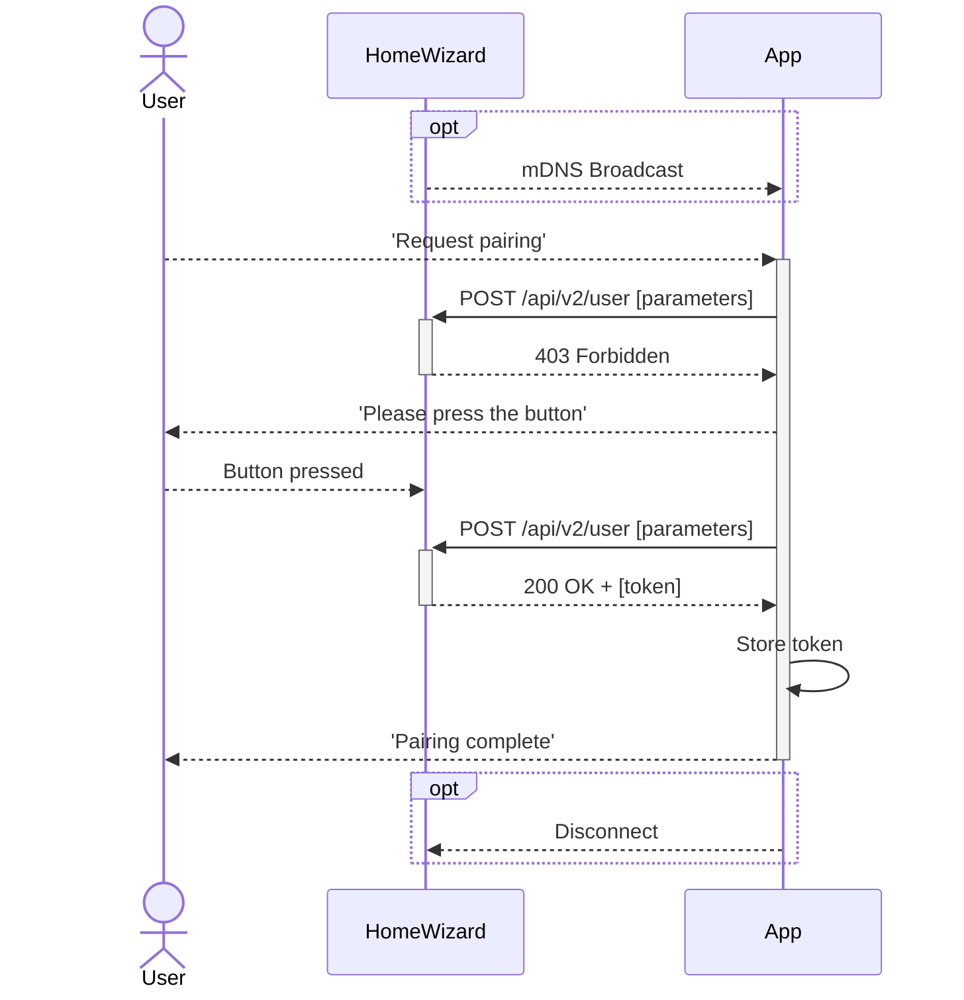

import Badge from '@site/src/components/Badge.js'
import PreliminaryWarning from '@site/src/components/PreliminaryWarning.js'

# Authorization `/api/v2/user`

:::danger[TODO]

-   Do not mix and match authenticated/authorized

:::

<PreliminaryWarning />

The HomeWizard Energy API requires a Bearer token to authenticate requests. This token should be included in the `Authorization` header of each request. To get a token you must create a user on the device.

{/* prettier-ignore */}
<Badge color='hw-green'>✓ P1 Meter</Badge>
<Badge color='hw-red'>✗ Energy Socket</Badge>
<Badge color='hw-red'>✗ Energy Display</Badge>
<Badge color='hw-red'>✗ kWh Meter</Badge>
<Badge color='hw-red'>✗ Water Meter</Badge>
<Badge color='hw-red'>✗ Plug-in Battery</Badge>

## Local and Cloud users

The local API is used by HomeWizard to enable direct communication between HomeWizard devices on a local network. To simplify setup for non-technical users, users can also be generated via the HomeWizard Energy app or background process using the cloud.

-   Cloud-generated users are prefixed with `cloud/`.
-   These tokens are for local device communication only and do not provide access to the cloud nor can be used by the cloud itself.
-   All users, including cloud-generated ones can be viewed with the [`GET /api/v2/user`](#list-users) endpoint.
-   Users created via the cloud can be revoked at any time, either by the cloud itself or through the [`DELETE /api/v2/user`](#delete-user) endpoint.
-   Disabling the cloud prevents the generation of cloud-generated users. For more details, see [cloud communication](/docs/v2/system#cloud-communication).

## Create user and get token

A user is created by sending a request to `POST /api/v2/user`. When successful a token is returned that can be used to authenticate further requests.

**Flow**

1. The **user opens your app** which initiates a network scan, discovering a device, such as a P1 Meter.
2. After selecting the P1 Meter, the **app sends a `POST /api/v2/user` request** with the [necessary parameters](#parameters)
3. The device responds with a **`403 Forbidden` status**, indicating that the user must physically press the button on the device to continue. The device starts to blink purple.
4. The app then **prompts the user** to press the button on the P1 Meters.
    - The app can keep sending requests while waiting for the user to press the button, this wil reset the timer
5. Once the user **presses the button**, the device will respond with a **`200 OK` status**, for the next request, returning a [token](#token).
    - The token is available for 30 seconds, after which the device will respond with a `403 Forbidden` status. The user must press the button again.
6. The app **saves the token** for future authentication purposes.
7. Finally, the app tests the connection and notifies the user that the **pairing process is complete**.



### Parameters

| Data | Type   | Description                                                                                                                                                                                                                                                                                                                                                  |
| ---- | ------ | ------------------------------------------------------------------------------------------------------------------------------------------------------------------------------------------------------------------------------------------------------------------------------------------------------------------------------------------------------------ |
| name | String | The name of the user.<br />- The name must be between 1 and 40 characters long.<br />- Allowed characters: `a-z`, `A-Z`, `0-9`, `-`, `_`, `\`, `/`, `#`, and spaces.<br />&nbsp;&nbsp;- (Regex: `^[a-zA-Z0-9\-_/\\# ]{1,40}$`)<br />- The name is unique per device. If the same name is used again, a new token will be issued and the old one invalidated. |

### Response

The response to a successful request will include the following fields:

| Data  | Type   | Description                                                                                                                                                                                                         |
| ----- | ------ | ------------------------------------------------------------------------------------------------------------------------------------------------------------------------------------------------------------------- |
| name  | String | The name of the user, prefixed with [`/local`](#local-and-cloud-users).                                                                                                                                             |
| token | String | A token that can be used to authenticate API requests.<br />- The token is 32 characters long.<br />- Token consists of uppercase letters (`A-Z`) and numbers (`0-9`).<br />&nbsp;&nbsp;- (Regex: `^[A-Z0-9]{32}$`) |

:::danger
Keep the token a secret, as it grants full access to the device, including the ability to generate new user.
:::

### Examples

#### Step 1: Request a Token

Keep sending requests while waiting for the user to press the button.

```http title="Request"
curl https://{ip_address}/api/v2/user \
  -X POST \
  -H "Content-Type: application/json" \
  -H "X-Api-Version: 2.0.0" \
  -d '{"name": "new_user"}'
```

```http title="Response"
https/1.1 403 Forbidden
Content-Type: application/json
Content-Length: <length>

{
    "error": "user:creation-not-enabled"
}
```

#### Step 2: User Presses Button and a new request is sent

```http title="Request"
curl https://{ip_address}/api/v2/user \
  -X POST \
  -H "Content-Type: application/json" \
  -H "X-Api-Version: 2.0.0" \
  -d '{"name": "new_user"}'
```

```http title="Response"
https/1.1 200 OK
Content-Type: application/json
Content-Length: <length>

{
    "token": "<TOKEN>",
    "name": "local/new_user"
}
```

#### Step 3: Access the API with the Token

```http title="Request"
curl https://{ip_address}/api \
  -H "Authorization: Bearer <TOKEN>" \
  -H "X-Api-Version: 2.0.0"
```

```http title="Response"
https/1.1 200 OK
Content-Type: application/json
Content-Length: <length>

{
    "product_type": "HWE-P1",
    "product_name": "P1 Meter",
    "serial": "5c2fafaabbcc",
    "firmware_version": "6.00",
    "api_version": "2.0.0"
}
```

## List users {#list-users}

To list all users, send a `GET /api/v2/user` request.

```http title="Request"
curl https://{ip_address}/api/v2/user
  -H "Authorization: Bearer <TOKEN>" \
  -H "X-Api-Version: 2.0.0"
```

```http title="Response"
https/1.1 200 OK
Content-Type: application/json
Content-Length: <length>

[
    {
        "name": "local/new_user"
        "current": true,
    },
    {
        "name": "cloud/cloud_user"
    }
]
```

## Delete a user {#delete-user}

To delete a user, send a `DELETE /api/v2/user` request with the user's name including the prefix. Deleting a user will invalidate the token.

:::warning
If you delete the user that is currently authenticated, you will lose access to the device. Make sure you have another user with access before deleting the current one. Generate a new token if necessary.
:::

```http title="Request"
curl https://{ip_address}/api/v2/user \
  -X DELETE \
  -H "Authorization: Bearer <TOKEN>" \
  -H "X-Api-Version: 2.0.0" \
  -d '{"name": "cloud/cloud_user"}'
```

```http title="Response"
https/1.1 204 No Content
Content-Length: 0
```
