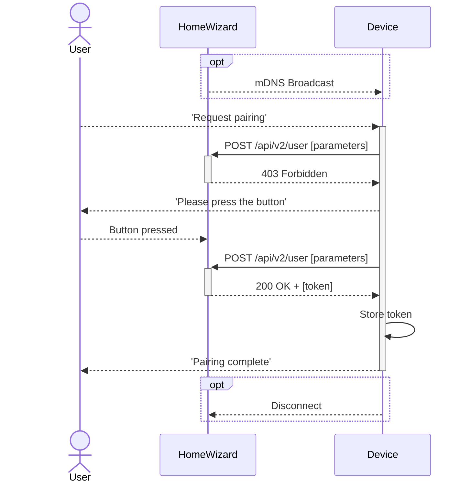

import Badge from '@site/src/components/Badge.js'
import PreliminaryWarning from '@site/src/components/PreliminaryWarning.js'

# Authorization `/api/v2/user`

:::danger[TODO]

-   Explain how long the initial request remains valid and the time window for pressing the button

:::

<PreliminaryWarning />

The HomeWizard Energy API requires a Bearer token to authenticate requests. This token should be included in the `Authorization` header of each request.

{/* prettier-ignore */}
<Badge color='hw-green'>✓ P1 Meter</Badge>
<Badge color='hw-red'>✗ Energy Socket</Badge>
<Badge color='hw-red'>✗ Energy Display</Badge>
<Badge color='hw-red'>✗ kWh Meter</Badge>
<Badge color='hw-red'>✗ Water Meter</Badge>
<Badge color='hw-red'>✗ Plug-in Battery</Badge>

## How to Get a Token

### Steps:

1. Find the device's IP address, for example using mDNS.
2. Send a `POST /api/v2/user` request with the necessary [parameters](#parameters).
3. The device will initially respond with a `403` status code, meaning the user needs to press the button on the device.
4. Prompt the user to press the button within 1 minute of the last request. You can keep sending requests while waiting.
5. Once the button is pressed, the device will respond with a `200` status and a [token](#token).
6. Save the token for future use.



## Parameters

When sending a `POST /api/v2/user` request, include the `name` parameter in the request body. This is a string that must be unique for each user.

-   The name must be between 1 and 40 characters long.
-   Allowed characters: `a-z`, `A-Z`, `0-9`, `-`, `_`, `\`, `/`, `#`, and spaces.
    -   (Regex: `^[a-zA-Z0-9\-_/\\# ]{1,40}$`)
-   The name is unique per device. If the same name is used again, a new token will be issued and the old one invalidated.

## Response

### Name

The name provided in [Parameters](#parameters), prefixed with `local/`.

### Token

A 32-character token that can be used to authenticate API requests. Include it in the `Authorization` header.

-   The token is 32 characters long.
-   Token consists of uppercase letters (`A-Z`) and numbers (`0-9`).
    -   (Regex: `^[A-Z0-9]{32}$`)

:::danger
Keep the token secure, as it grants full access to the device, including the ability to generate new user.
:::

## Local and Cloud users

The local API is used by HomeWizard to enable direct communication between HomeWizard devices on a local network. To simplify setup for non-technical users, users can also be generated via the HomeWizard Energy app or background process using the cloud.

-   Cloud-generated users are prefixed with `cloud/`.
-   These tokens are for local device communication only and do not provide access to the cloud nor can be used by the cloud itself.
-   All users, including users cloud-generated ones can be viewed with the [`GET /api/v2/user`](#list-users) endpoint.
-   Users created via the cloud can be revoked at any time, either by the cloud itself or through the [`DELETE /api/v2/user`](#delete-user) endpoint.
-   Disabling the cloud prevents the generation of cloud-generated users. For more details, see [cloud communication](/docs/v2/system#cloud-communication).

## Example Requests

### Step 1: Request a Token

Keep sending requests while waiting for the user to press the button.

```http title="Request"
curl https://{ip_address}/api/v2/user \
  -X POST \
  -H "Content-Type: application/json" \
  -H "X-Api-Version: 2.0.0" \
  -d '{"name": "new_user"}'
```

```http title="Response"
https/1.1 403 Forbidden
Content-Type: application/json
Content-Length: <length>

{
    "error": "user:creation-not-enabled"
}
```

### Step 2: User Presses Button

```http title="Request"
curl https://{ip_address}/api/v2/user \
  -X POST \
  -H "Content-Type: application/json" \
  -H "X-Api-Version: 2.0.0" \
  -d '{"name": "new_user"}'
```

```http title="Response"
https/1.1 200 OK
Content-Type: application/json
Content-Length: <length>

{
    "token": "<TOKEN>",
    "name": "local/new_user"
}
```

### Step 3: Access the API with the Token

```http title="Request"
curl https://{ip_address}/api \
  -H "Authorization: Bearer <TOKEN>" \
  -H "X-Api-Version: 2.0.0"
```

```http title="Response"
https/1.1 200 OK
Content-Type: application/json
Content-Length: <length>

{
    "product_type": "HWE-P1",
    "product_name": "P1 Meter",
    "serial": "5c2fafaabbcc",
    "firmware_version": "6.00",
    "api_version": "2.0.0"
}
```

## List users

To list all users, send a `GET /api/v2/user` request.

```http title="Request"
curl https://{ip_address}/api/v2/user
  -H "Authorization: Bearer <TOKEN>" \
  -H "X-Api-Version: 2.0.0"
```

```http title="Response"
https/1.1 200 OK
Content-Type: application/json
Content-Length: <length>

[
    {
        "name": "local/new_user"
        "current": true,
    },
    {
        "name": "cloud/cloud_user"
    }
]
```

## Delete a user {#delete-user}

To delete a user, send a `DELETE /api/v2/user` request with the user's name including the prefix. Deleting a user will invalidate the token.

:::warning
If you delete the user that is currently authenticated, you will lose access to the device. Make sure you have another user with access before deleting the current one. Generate a new token if necessary.
:::

```http title="Request"
curl https://{ip_address}/api/v2/user \
  -X DELETE \
  -H "Authorization: Bearer <TOKEN>" \
  -H "X-Api-Version: 2.0.0" \
  -d '{"name": "cloud/cloud_user"}'
```

```http title="Response"
https/1.1 204 No Content
Content-Length: 0
```
