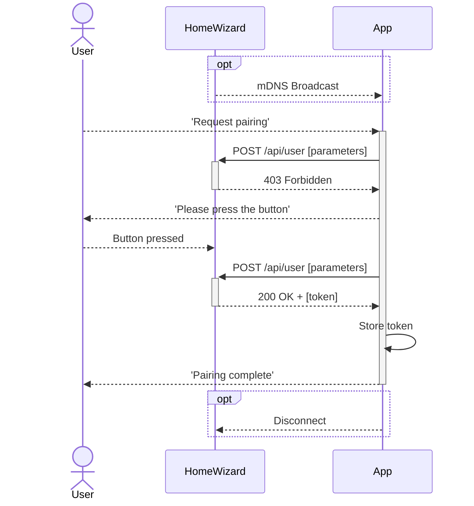

import Badge from '@site/src/components/Badge.js'

# Authorization `/api/user`

{/* prettier-ignore */}
<Badge color='hw-green' icon='mdi:check' subtext='Requires Firmware 6.0000 or later'>P1 Meter</Badge>
<Badge color='hw-grey' icon='mdi:wrench' subtext='In development'>Energy Socket</Badge>
<Badge color='hw-grey' icon='mdi:wrench' subtext='In development'>Energy Display</Badge>
<Badge color='hw-purple' icon='mdi:test-tube' subtext='Requires firmware 5.0000 or later (in beta)'>kWh Meter</Badge>
<Badge color='hw-grey' icon='mdi:wrench' subtext='In development'>Watermeter</Badge>
<Badge color='hw-green' icon='mdi:check' subtext='Supported'>Plug-In Battery</Badge>
<br />
<sub>_See [Supported Devices](/docs/introduction#devices) for more information._</sub>

---

The HomeWizard Energy API requires a Bearer token to authorize requests. This token should be included in the `Authorization` header of each request. To get a token you must create a user on the device.

## Create User and get Token

A user is created by sending a POST /api/user request when they press the button on the device. This action confirms that the user has possession of the device and that the application is authenticated to generate a token. Once these steps are completed, a token is returned which is used to authorize for future requests.

**Flow**

To get an idea for how an application should acquire a token, we have outlined a flow below.

1. The **user opens your app** which initiates a network scan, discovering a device, such as a P1 Meter.
2. After selecting the P1 Meter, the **app sends a `POST /api/user` request** with the [necessary parameters](#parameters)
3. The device responds with a **`403 Forbidden` status**, indicating that the user must physically press the button on the device to continue.
4. The app then **prompts the user** to press the button on the P1 Meters.
    - The app can keep sending requests while waiting for the user to press the button, this wil reset the timer
5. Once the user **presses the button**, the device will respond with a **`200 OK` status**, for the next request, returning a [token](#token).
    - Once the button is pressed, you have a window of 30 seconds to request the token.
6. The app **saves the token** for future requests.
7. Finally, the app tests the connection and notifies the user that the **pairing process is complete**.



### Parameters

| Data | Type   | Description                                                                                                                                                                                                                                                                                                                                                                                                                                                                                                                                                                                           |
| ---- | ------ | ----------------------------------------------------------------------------------------------------------------------------------------------------------------------------------------------------------------------------------------------------------------------------------------------------------------------------------------------------------------------------------------------------------------------------------------------------------------------------------------------------------------------------------------------------------------------------------------------------- |
| name | String | The name of the user.<br />- The name must be prefixed with `local/`, see [local and cloud users](#local-and-cloud-users).<br />- The name itself must be between 1 and 40 characters long.<br />- Allowed characters: `a-z`, `A-Z`, `0-9`, `-`, `_`, `\`, `/`, `#`, and spaces.<br />&nbsp;&nbsp;- (Regex: `^local\/[a-zA-Z0-9\-_/\\# ]{1,40}$`)<br />&nbsp;&nbsp;- (Examples: `local/my-app`, `local/40character-name/with#special\characters`)<br />- The name should be unique for this device. If the same name is reused, a new token will be issued, and the previous one will be invalidated. |

### Response {#token}

The response to a successful request will include the following fields:

| Data  | Type   | Description                                                                                                                                                                                        |
| ----- | ------ | -------------------------------------------------------------------------------------------------------------------------------------------------------------------------------------------------- |
| name  | String | The name of the user, prefixed with `local/`. See see [local and cloud users](#local-and-cloud-users).                                                                                             |
| token | String | A token that can be used to authorize API requests.<br />- The token is 32 characters long.<br />- Token consists of letters `A-F` and numbers `0-9`.<br />&nbsp;&nbsp;- (Regex: `^[A-F0-9]{32}$`) |

:::danger
Keep the token a secret, as it grants full access to the device's data.
:::

### Examples

#### Step 1: Request a Token

Keep sending requests while waiting for the user to press the button.

```http title="Request"
curl https://<IP ADDRESS>/api/user --insecure \
  -X POST \
  -H "Content-Type: application/json" \
  -H "X-Api-Version: 2" \
  -d '{"name": "local/new_user"}'
```

```http title="Response"
https/1.1 403 Forbidden
Content-Type: application/json

{
    "error": "user:creation-not-enabled"
}
```

#### Step 2: User Presses Button and a new request is sent

```http title="Request"
curl https://<IP ADDRESS>/api/user --insecure \
  -X POST \
  -H "Content-Type: application/json" \
  -H "X-Api-Version: 2" \
  -d '{"name": "local/new_user"}'
```

```http title="Response"
https/1.1 200 OK
Content-Type: application/json

{
    "token": "<TOKEN>",
    "name": "local/new_user"
}
```

#### Step 3: Access the API with the Token

```http title="Request"
curl https://<IP ADDRESS>/api --insecure \
  -H "Authorization: Bearer <TOKEN>" \
  -H "X-Api-Version: 2"
```

```http title="Response"
https/1.1 200 OK
Content-Type: application/json

{
    "product_name": "P1 Meter",
    "product_type": "HWE-P1",
    "serial": "5c2fafaabbcc",
    "firmware_version": "6.00",
    "api_version": "2.0.0"
}
```

When the authorization token is invalid or not provided, the response will be `401 Unauthorized`.

```http title="Response when unauthorized"
https/1.1 401 Unauthorized
Content-Type: application/json

{
    "error": "user:unauthorized"
}
```

## List Users {#list-users}

To list all users, send a `GET /api/user` request.

```http title="Request"
curl https://<IP ADDRESS>/api/user --insecure \
  -H "Authorization: Bearer <TOKEN>" \
  -H "X-Api-Version: 2"
```

```http title="Response"
https/1.1 200 OK
Content-Type: application/json

[
    {
        "name": "local/new_user"
        "current": true,
    },
    {
        "name": "cloud/cloud_user"
    }
]
```

## Delete a User {#delete-user}

To delete a user, send a `DELETE /api/user` request with the user's name including the prefix. Deleting a user will invalidate the token.

:::warning
If you delete the token currently associated with your user, you will lose access to the device. Ensure that another user has access before deleting your own token, and generate a new token if needed.
:::

```http title="Request"
curl https://<IP ADDRESS>/api/user --insecure \
  -X DELETE \
  -H "Authorization: Bearer <TOKEN>" \
  -H "X-Api-Version: 2" \
  -d '{"name": "cloud/cloud_user"}'
```

```http title="Response"
https/1.1 204 No Content
Content-Length: 0
```

## Local and Cloud Users

The local API is used by HomeWizard to enable direct communication between HomeWizard devices on a local network. To simplify setup for non-technical users, tokens can also be generated via the HomeWizard Energy app or background process using the cloud.

-   Cloud-generated users are prefixed with `cloud/`, local users are prefixed with `local/`.
-   These tokens are for local device communication only and do not provide access to the cloud nor can be used by the cloud itself.
-   All users, including cloud-generated ones can be viewed with the [`GET /api/user`](#list-users) endpoint.
-   Users created via the cloud can be revoked at any time, either by the cloud itself or through the [`DELETE /api/user`](#delete-user) endpoint.
-   Disabling the cloud prevents the generation of cloud-generated users. For more details, see [cloud communication](/docs/v2/system#cloud-communication).

## SSL Certificate Validation (HTTPS) {#https}

### Certificate

To make sure your application communicates securely with the device, we recommend to validate the SSL certificate. The device certificate can be validated against the HomeWizard CA certificate.

You can download the certificate [here](/homewizard-ca-cert.pem).

### Hostname Validation

HTTPS is designed that the server certificate is validated against the hostname of the server. Because the local API does not use a domain name, the hostname is set to the product type and serial number of the device, for example `appliance/p1dongle/5c2fafaabbcc`. The example below shows how to validate the hostname in Python, as `cURL` does not support the validation of the hostname used by HomeWizard.

The hostname can be obtained via [mDNS](/docs/discovery#_homewizard_tcp) or by combining the product type and serial number of the device. Due to legacy reasons, the product type set in the certificate is different from the actual product type.

| Device          | Product Type   |
| --------------- | -------------- |
| P1 Meter        | `p1dongle`     |
| Energy Socket   | `energysocket` |
| Energy Display  | `display`      |
| kWh Meter       | `energymeter`  |
| Watermeter      | `watermeter`   |
| Plug-In Battery | `battery`      |

### Example

```python title="Certificate validation via Python"
# Default request library does not support custom hostname validation, use aiohttp instead
import aiohttp
import ssl
import asyncio

# Create an SSL context, telling it to validate the hostname
ca_cert_path = "homewizard-ca-cert.pem"
ssl_context = ssl.create_default_context(cafile=ca_cert_path)
ssl_context.hostname_checks_common_name = True

async def fetch(url, hostname):
    async with aiohttp.ClientSession() as session:

        # Make the request, validate that the hostname matches the certificate
        async with session.get(url, ssl=ssl_context, server_hostname=hostname) as response:
            return await response.text()

# Example usage, make sure to set the correct IP and hostname
result = asyncio.run(fetch("https://192.168.5.108/api", "appliance/p1dongle/5c2fafaabbcc"))
print(result) # prints {"error":"user:unauthorized"}, which is good as it does not throw an SSL error.
```
